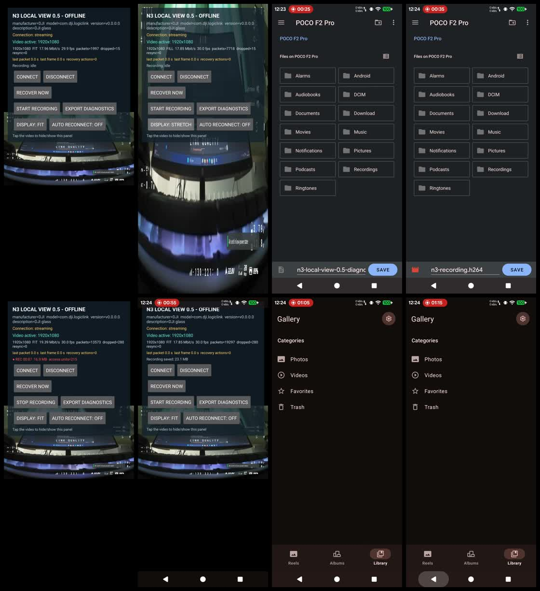
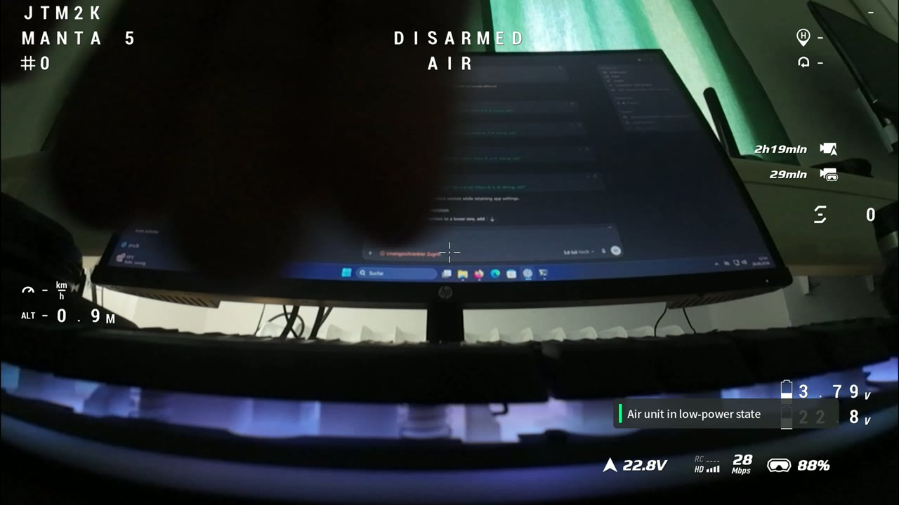

# DJI Video Grabber — N3 Local View (Alpha)

> **Alpha software:** this project is experimental and may fail, disconnect, show a corrupted image, or behave differently after DJI or Android firmware updates. Never rely on it for flight safety, navigation, or regulatory compliance.

An unofficial, privacy-minimal Android receiver for the wired live-view output of **DJI Goggles N3** when used with a **DJI O4 Air Unit Pro** or **DJI Avata 2**. It replaces the DJI Fly viewing screen for this narrow use case: the goggles connect directly to an Android device over USB, and the application displays the received H.264 video locally.

The application does not control the aircraft. It has no flight controls, activation workflow, firmware updater, DJI account integration, or cloud connection. It requests no Internet, location, camera, microphone, account, contacts, or broad storage permission.

## Development approach

This project was built through **vibe coding**: iterative AI-assisted development directed by user requirements, reverse-engineering research, automated tests, and real hardware feedback. The original v0.1 stream path was confirmed on physical hardware, but the project remains alpha-quality and should be independently reviewed before use.

This repository is not affiliated with, endorsed by, or supported by DJI.

## Repository layout

- The repository root remains the hardware-proven non-GUI line: **v0.5.0**.
- [`versions/`](versions/) contains clean, standalone source snapshots from **v0.1.0 through v0.6.0**.
- **v0.6.0** is an explicitly experimental DJI Unchained VOC preview. It adds aspect selection, a centered 9:16 Shorts crop/preview, experimental 720×1280 MP4 capture, and the supplied offline artwork/icon while preserving the proven USB/H.264 path.

## Proof of operation

These demonstrations show the non-GUI v0.5.0 application receiving the goggles feed, switching display modes, recording raw H.264, and playing the recorded feed back.

| Phone workflow | Recorded goggles feed |
|---|---|
| [](https://github.com/jtm2kfpv-git/DJI_Video_Grabber/releases/download/v0.5.0/demo-phone-live-view-and-recording.mp4) | [](https://github.com/jtm2kfpv-git/DJI_Video_Grabber/releases/download/v0.5.0/demo-recorded-goggles-feed.mp4) |
| Live USB view, controls, recording, and file save. | Raw goggles feed recorded by the application. |

Click either preview to open the full video. The public demonstration copies have audio and media metadata removed for privacy.

Experimental, privacy-minimal Android receiver for the wired live-view output of DJI Goggles N3 with DJI O4 Air Unit Pro or DJI Avata 2.

## Privacy properties

- No `INTERNET` permission.
- No location, microphone, camera, account, contacts or broad storage permissions.
- No analytics, advertising, telemetry, crash-reporting SDK or updater.
- USB data is decoded locally and displayed through Android `MediaCodec`.
- Root is not requested or used.

## Current status

The original 0.1 implementation has been hardware-confirmed on Goggles N3 with DJI O4 Air Unit Pro / DJI Avata 2 and an Android 16 LineageOS phone. Later versions preserve that exact USB/protocol path. Version 0.5 adds permission-free local raw H.264 recording. Version 0.6 adds an experimental branded UI and Shorts workflow; it is published as a pre-release and is not promoted as the stable line.

Implemented:

- Android Open Accessory discovery and user permission flow.
- Runtime display of the accessory identity strings.
- Exact two captured N3/O4 video-start packets, repeated every five seconds.
- Incremental N3 `logiclink` parser (`55 cc`, 16-bit port, 16-bit payload length, two zero bytes).
- Extraction of H.264 on port `0x574a`.
- Annex-B NAL/access-unit assembly across arbitrary USB boundaries.
- Hardware H.264 decode to a full-screen `SurfaceView`.
- Correct-aspect **FIT**, crop-to-screen **FILL**, and legacy **STRETCH** display modes.
- Tap the video to hide or show the control panel.
- One-second local bitrate and rendered-FPS measurements, plus packet, decoder-drop and resynchronization counters.
- Optional automatic connection when the known DJI accessory is attached or the app opens.
- Automatic recovery after USB read/write or accessory-open failures, using a capped 1/2/5/10-second retry sequence.
- Explicit disconnected, permission, connecting, connected, streaming and retry-wait states.
- Manual disconnect cancels queued retries; **Connect** immediately resets the retry sequence.
- Stream-health display with last-packet age, last-rendered-frame age and recovery-action count.
- Eight-second startup grace followed by conservative staged stall recovery: resend keepalive, reset local decoder, then reopen USB.
- Automatic stall recovery runs only while **Auto reconnect** is enabled and a display surface is active.
- **Recover now** performs an explicit USB reopen without requiring automatic recovery.
- Local diagnostics export through Android's user-selected document picker, with no storage permission.
- User-selected local `.h264` recording with no storage permission, re-encoding or quality loss.
- Recording begins only after cached SPS/PPS and an IDR keyframe are available.
- Dedicated bounded writer queue prevents slow storage from blocking USB reception or live decoding.
- Recording duration, bytes, access-unit count, overload and write-error status.
- Safe recording finalization on manual stop, USB reset, recovery or application close.
- Persistent display-mode and automatic-connection preferences.
- Unit tests for fragmented framing, resynchronization, control-packet integrity and H.264 access-unit assembly.
- Unit tests for all three display geometries and their mode cycle.
- Unit tests for retry progression, cap and reset behavior.
- Unit tests for watchdog timing, opt-in/surface gates, recovery cancellation and counter-reset escalation.
- Unit tests for keyframe gating, SPS/PPS prefixing, duplicate avoidance, empty cancellation, storage failure and queue overload.
- Stream-state reset on reconnect and safe decoder restart when SPS/PPS changes.
- Hardware-decoder fallback if the Android codec rejects low-latency mode.
- Refusal to send N3 packets to accessories that do not identify as DJI or `logiclink`.

## Bench-test order

1. Remove propellers and provide cooling/airflow where required.
2. Activate and link the aircraft/Air Unit normally; verify video in Goggles N3.
3. Install and open N3 Local View.
4. Connect a known-good USB-C data cable from N3 to the phone.
5. Note the accessory identity shown by the app and press **Connect**. Enable **Auto reconnect** only if desired.
6. Use **Display: FIT** for the correct full-frame aspect ratio. **FILL** crops the edges to occupy the screen; **STRETCH** reproduces the original full-screen behavior.
7. If video packets remain zero, capture the displayed identity and `adb logcat -s N3LocalView` output. The app deliberately omits the accessory serial number from both. Do not repeatedly change USB roles while the aircraft is armed.

The app sends only the two published camera/app subscription packets. It contains no flight-control UI or exploratory DUML commands.

## Build

The project targets Android API 36 and Java 17. With an Android SDK and Gradle wrapper installed:

```text
./gradlew clean testDebugUnitTest lintDebug lintRelease assembleDebug assembleRelease
```

To independently compare the embedded control bytes with the pinned upstream checkout:

```text
python tools/verify_protocol.py /path/to/dji_protocol
```

The ready-to-install debug APK is `output/apk/N3-Local-View-0.5.0-debug.apk`. The release APK is unsigned by design; sign it with a private key you control after testing.

Raw recordings can be played directly in VLC or remuxed without re-encoding:

```text
ffmpeg -i n3-recording.h264 -c copy n3-recording.mp4
```

Each published version has a standalone source snapshot under [`versions/`](versions/). Installable APKs and checksum manifests are attached to the matching GitHub release.

## Protocol basis

The N3 mobile framing and control packets are pinned to the reverse-engineering documentation and executable reference at commit `50c71b65fdb6825783f724e5cd3c1f09c2aa88ce`:

- https://github.com/samuelsadok/dji_protocol/blob/50c71b65fdb6825783f724e5cd3c1f09c2aa88ce/usb_mobile_protocol.md
- https://github.com/samuelsadok/dji_protocol/blob/50c71b65fdb6825783f724e5cd3c1f09c2aa88ce/scripts/video_out_mobile.py
