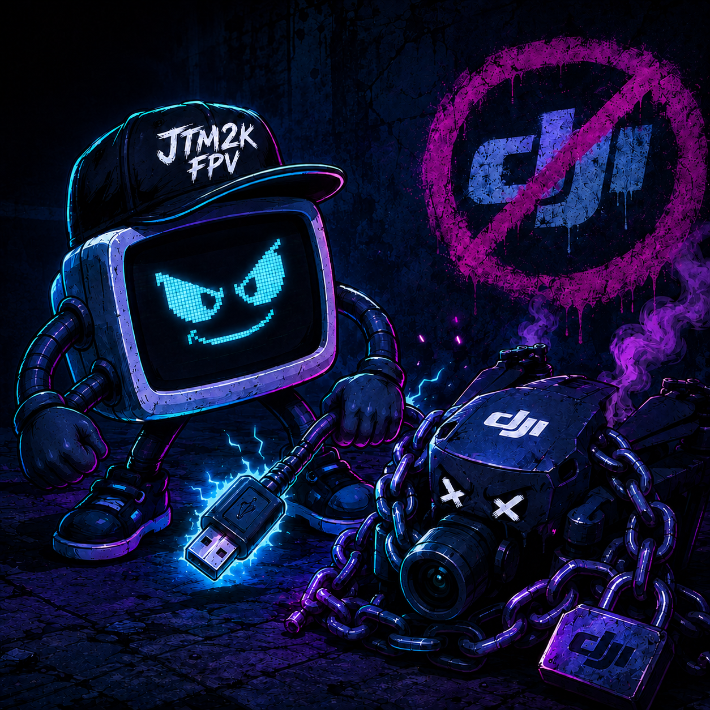
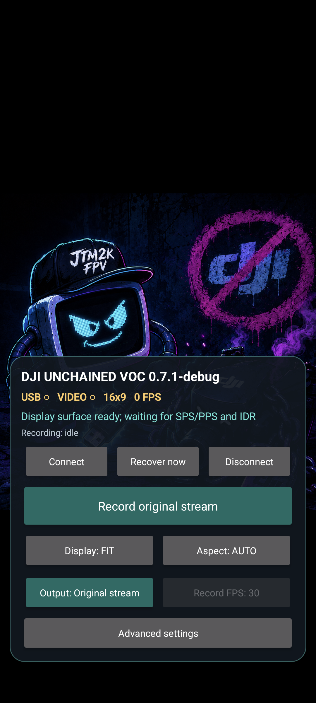
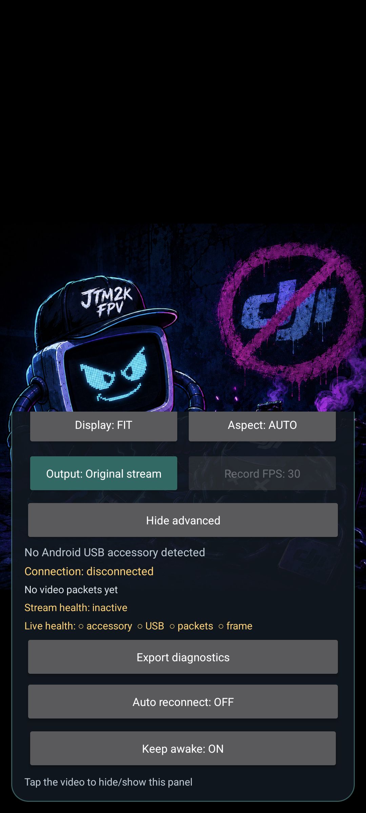
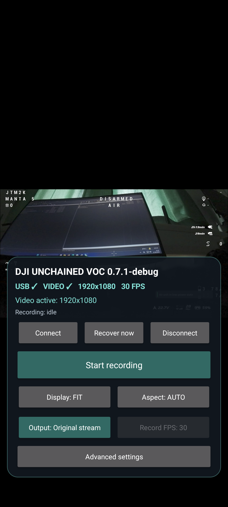
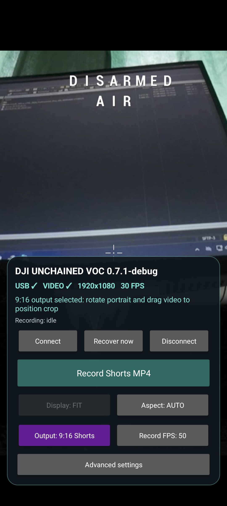
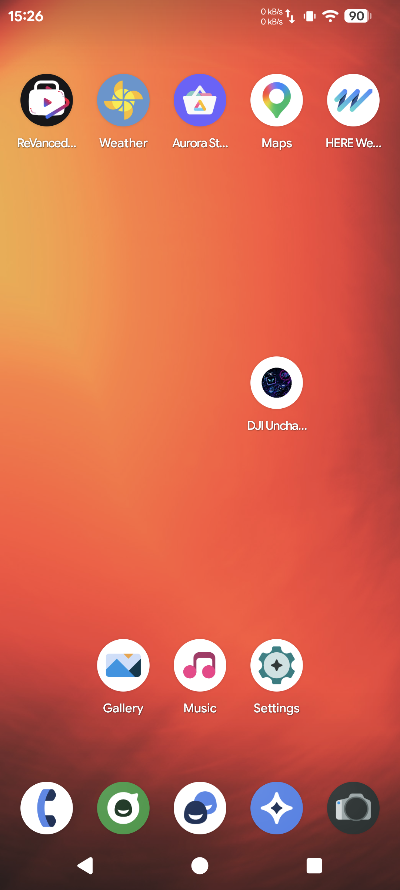

# DJI Unchained VOC (Alpha)

<p align="center">
  
</p>

<p align="center"><strong>Local DJI Goggles N3 live view for Android—without DJI Fly, accounts, analytics or cloud access.</strong></p>

> **Alpha software:** this project is experimental and may fail or behave differently after DJI or Android firmware updates. Never rely on it for flight safety, navigation or regulatory compliance.

DJI Unchained VOC is an unofficial Android receiver for the wired live-view output of **DJI Goggles N3** with **DJI O4 Air Unit Pro** or **DJI Avata 2**. The goggles connect directly to Android over USB and the app decodes the received H.264 video locally.

It does not control the aircraft and has no activation workflow, firmware updater, DJI account integration or cloud connection. This project is not affiliated with, endorsed by or supported by DJI.

## Current version

The repository root contains **v0.7.2**, the current development release.

- **v0.7.1** is the latest hardware-tested checkpoint on the target Android 16 LineageOS phone with DJI Goggles N3.
- **v0.7.2** builds, lints and passes 48 unit tests. Its new lossless MP4 remuxer and revised 30/60 FPS Shorts encoder still require a short device regression test.
- [`versions/`](versions/) preserves standalone source snapshots from v0.1.0 through v0.7.2.
- Installable APKs, checksum manifests and source ZIPs are attached to the matching GitHub prereleases.

## Hardware test gallery

These unedited screenshots were supplied from the Android 16 hardware test of the v0.7.1 debug build.

| Disconnected screen | Ready controls | Advanced diagnostics |
|---|---|---|
|  |  |  |

| Live Goggles N3 view | 9:16 Shorts mode | Android launcher icon |
|---|---|---|
|  |  |  |

Earlier v0.5.0 proof videos remain available for the [phone workflow](https://github.com/jtm2kfpv-git/DJI-Unchained-VOC/releases/download/v0.5.0/demo-phone-live-view-and-recording.mp4) and [recorded goggles feed](https://github.com/jtm2kfpv-git/DJI-Unchained-VOC/releases/download/v0.5.0/demo-recorded-goggles-feed.mp4). The public copies have audio and media metadata removed for privacy.

## Features

- Android Open Accessory discovery and explicit USB permission flow.
- Exact published N3/O4 subscription packets with conservative keepalive handling.
- Incremental `logiclink` framing and extraction of H.264 video on port `0x574a`.
- Hardware H.264 decode to a full-screen `SurfaceView`.
- **FIT**, **FILL** and **STRETCH** display behavior.
- Source-aspect selection for **AUTO**, **16:9** and **4:3**.
- Center-positionable **9:16 Shorts** crop and experimental 720×1280 MP4 recording.
- **30/60 FPS** Shorts selection with actual output-FPS diagnostics.
- Default lossless original-stream MP4 remuxing with monotonic timestamps.
- Optional raw Annex-B H.264 recording for troubleshooting and compatibility.
- Original recording begins only after valid dimensions, SPS, PPS and an IDR keyframe.
- Original files save locally to `Movies/DJI Unchained VOC` without leaving the app.
- Bounded recording queues keep slow storage from blocking USB reception or decoding.
- Automatic reconnect, staged stream recovery and manual **Recover now**.
- Responsive bottom control tray, top disconnected artwork and launcher icon.
- Privacy-filtered diagnostic schema 3 export with stream, decoder, recovery and recorder metrics.

## Privacy

- No `INTERNET` permission.
- No location, camera, microphone, account, contacts or broad-storage permission.
- No analytics, advertising, telemetry, crash-reporting SDK or updater.
- USB video, recordings, artwork, preferences and diagnostics remain local.
- Root is not requested or required.
- MediaProjection permission is requested only when starting a Shorts recording.

## Recording

### Original incoming stream

1. Connect the goggles and wait for `USB ✓ VIDEO ✓`.
2. Select `Output: Original stream`.
3. Choose `Original format: Lossless MP4` or `Raw H.264` in Advanced settings.
4. Tap **Record original stream** and later **Stop and save**.

The MP4 path remuxes the incoming compressed stream without re-encoding. Raw H.264 has no container timestamps, so some players may guess the wrong playback speed.

### 9:16 Shorts

1. Select `Output: 9:16 Shorts` and rotate Android to portrait.
2. Drag the image horizontally to position the crop.
3. Select **Record FPS: 30** or **Record FPS: 60**.
4. Tap **Record Shorts MP4**, choose a destination and approve Android's screen-capture prompt.

The selected frame rate is a maximum; actual FPS depends on the incoming feed, decoder, encoder and device load.

## Bench-test order

1. Remove propellers and provide cooling/airflow where required.
2. Activate and link the aircraft or Air Unit normally; verify video in Goggles N3.
3. Install and open DJI Unchained VOC.
4. Connect a known-good USB-C data cable from N3 to the Android device.
5. Approve USB access and press **Connect** if automatic connection is disabled.
6. Verify live video before testing recording or recovery behavior.
7. Export diagnostics if a failure is repeatable; review the file before sharing it publicly.

## Build

The project targets Android API 36 and Java 17:

```powershell
.\gradlew.bat clean testDebugUnitTest lintDebug lintRelease assembleDebug assembleRelease
```

For the complete guarded release workflow, including APK identity, permission and signature checks, exact source packaging and SHA-256 manifests:

```powershell
.\tools\build-release.ps1 -ValidateOnly
.\tools\build-release.ps1
```

The debug application ID is `local.n3view.voc.debug`; release builds use `local.n3view.voc`. Release APKs are intentionally unsigned.

To compare the embedded control bytes against the pinned upstream checkout:

```text
python tools/verify_protocol.py /path/to/dji_protocol
```

See [`PROJECT-STATE.md`](PROJECT-STATE.md), [`NEXT-RELEASE.md`](NEXT-RELEASE.md), [`TESTING.md`](TESTING.md), [`VERSIONS.md`](VERSIONS.md), [`CHANGELOG.md`](CHANGELOG.md), the [v0.7 implementation matrix](docs/V0.7-IMPLEMENTATION.md) and [`BUILD-VERIFICATION.md`](BUILD-VERIFICATION.md) for detailed status.

## Development approach

This project was built through **vibe coding**: iterative AI-assisted development directed by user requirements, reverse-engineering research, automated tests and physical hardware feedback. Independent source review is strongly encouraged.

## Protocol basis

The mobile framing and N3 control packets are pinned to `samuelsadok/dji_protocol` commit `50c71b65fdb6825783f724e5cd3c1f09c2aa88ce`:

- https://github.com/samuelsadok/dji_protocol/blob/50c71b65fdb6825783f724e5cd3c1f09c2aa88ce/usb_mobile_protocol.md
- https://github.com/samuelsadok/dji_protocol/blob/50c71b65fdb6825783f724e5cd3c1f09c2aa88ce/scripts/video_out_mobile.py

## License

The source code and documentation are licensed under the [Apache License 2.0](LICENSE). Branded artwork and third-party trademarks are excluded from that grant; see [`ASSET-LICENSE.md`](ASSET-LICENSE.md).

DJI is a trademark of its respective owner. This project is unofficial and is not affiliated with, endorsed by or supported by DJI.
